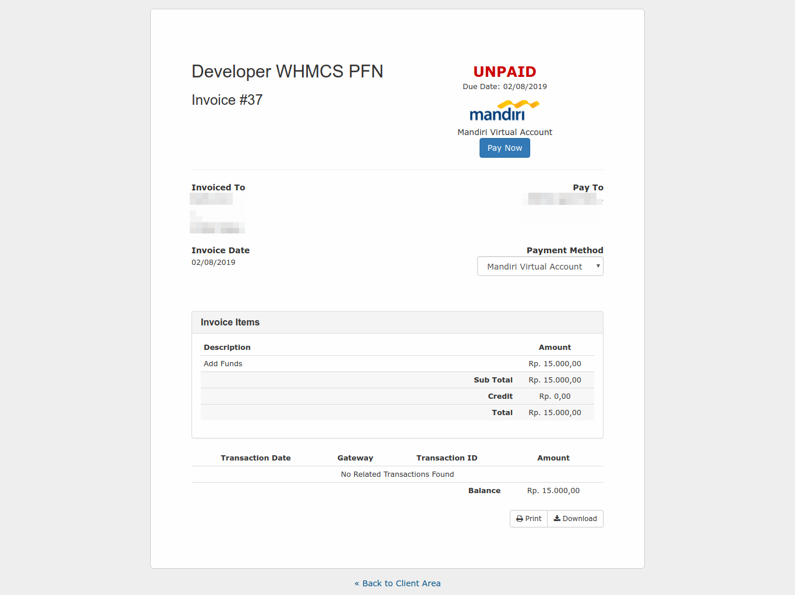

# Xendit Payment Gateway Module WHMCS (Unofficial)

## Important
* *This script make without guarantee.*
* *If you found error or something else, please make a new issue or pull request.*

## Feature
* [x] Using XenInvoice Each Virtual Account
* [x] Added Fee Option (If you want you're costumer to pay you're payment gateway fee)
* [x] Set Expired Invoice Upto 3 Days
* [x] Allow Xendit to Send Email to Client
* [x] Redirect Callback Integration
* [x] Automatic confirmation payment on success

## Payment Support
| Name Bank    | Support |
| ------------ | ------- |
| BCA          | yes     |
| BNI          | yes     |
| BRI          | yes     |
| MANDIRI      | yes     |
| PERMATA BANK | yes     |
| Retail       | -       |
| OVO          | -       |
| Credit Card  | -       |
| FVA BRI      | -       |
| FVA BNI      | -       |
| FVA MANDIRI  | -       |

## Screenshoot

## Install Instruction

### Setup in WHMCS
* Upload all files in folder `/modules` to your WHMCS Installation
* In WHMCS Admin Panel, Navigate to `Setup` => `Payments` => `Payment Gateways` => `All Payment Gateways`
* Click on `Xendit XXXX` Name of Payment Gateway to Active

#### Important For `Payment Fee` :
* Fee from Xendit it's not include PPN 10%, so when you input in `Payment Fee`, you need input all of fee you get from Xendit.
* By Default, our modules set Fee to Rp. 4.950 (Default: 4.500 + PPN 10% (From 4.500*10% = 450) = 4.950)
* When client click `Pay Now` button on invoice, they will get value `Total` + `Fee`
* If you don't want user to pay you're fee, just set `Payment Fee` to `0`

### Get Private Key and Set Callback in Xendit

### Get Private Keys
* Login to Xendit Dashboard
* Navigate to `Settings` => `Security`
* In section `LIVE API Keys - Secret`, to create key, click a button `Create Key`, and copy this key, paste in `Xendit Private API Keys` at WHMCS Payment Gateway Configuration
* Enter you're WHMCS Billing Ips to `IP Address Whitelist`

### Set Callback
* Login to Xendit Dashboard
* Navigate to `Settings` => `Configuration` => `Invoice`
* In `Callback URLs` set in `Development` or `Production` url like this :
  * Index/Sub-Domain WHMCS : `https://example.domain/modules/gateways/callback/xendit_callback.php`
  * Sub-Folder WHMCS : `https://example.domain/whmcs/modules/gateways/callback/xendit_callback.php`
* Click `Save & Test Callback`

## INFO
* By : Juni Yadi
* Based on [Xendit PHP SDK](https://github.com/xendit/xendit-php-clients/)
* License: MIT 