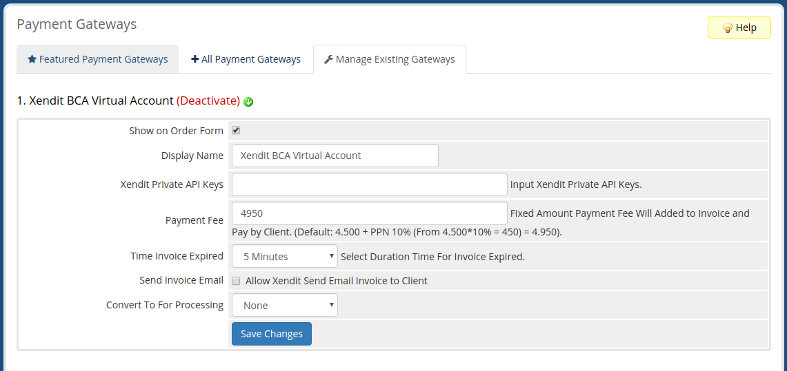

# Xendit Payment Gateway Module WHMCS (Unofficial)

## Important
* *This script make without guarantee.*
* *If you found error or something else, please make a new issue or pull request.*

## Feature
* [x] Using XenInvoice Each Virtual Account
* [x] Added Fee Option (If you want you're costumer to pay you're payment gateway fee)
* [x] Set Expired Invoice Upto 3 Days
* [x] Allow Xendit to Send Email to Client
* [x] Redirect Callback Integration
* [x] Automatic confirmation payment on success

## Payment Support
| Name Bank    | Support |
| ------------ | ------- |
| BCA          | yes     |
| BNI          | yes     |
| BRI          | yes     |
| MANDIRI      | yes     |
| PERMATA BANK | yes     |
| Retail       | -       |
| OVO          | -       |
| Credit Card  | -       |

## Screenshoot

## INFO
* By : Juni Yadi
* Based on [Xendit PHP SDK](https://github.com/xendit/xendit-php-clients/)
* License: MIT 